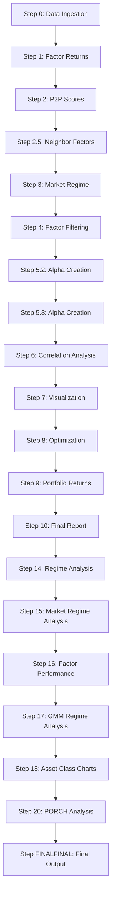

# T2 Factor Timing System - Comprehensive Documentation

## Overview

The T2 Factor Timing system is a sophisticated multi-step investment strategy that creates and optimizes factor timing strategies for country-level investment allocations. This system uses historical factor returns to predict future performance and optimize allocations across 35+ countries in both developed and emerging markets.

## System Architecture



## Detailed Workflow

### Step 0: Data Ingestion (`Step Zero Data Ingestion.py`)
**Purpose**: Loads and prepares all required data for the factor timing system
- **Inputs**: 
  - `country_data.csv`: Country-level return data
  - `factor_data.csv`: Factor return data
  - `country_metadata.csv`: Country classifications and metadata
- **Processing**: 
  - Merges data on dates and countries
  - Handles missing data
  - Creates unified dataset across all dates
- **Outputs**: `step0_output.csv` - Cleaned, merged dataset ready for factor analysis

### Step 1: Factor Returns (`Step One Factor Returns.py`)
**Purpose**: Calculates factor returns for each country and factor combination
- **Inputs**: `step0_output.csv`
- **Processing**: 
  - Computes factor returns for each country
  - Handles factor definitions and calculations
  - Creates comprehensive factor return dataset
- **Outputs**: `step1_output.csv` - Factor returns by country and date

### Step 2: P2P Scores (`Step Two P2P Scores.py`)
**Purpose**: Calculates Price-to-Peak momentum scores for countries
- **Inputs**: `step0_output.csv`
- **Processing**: 
  - Computes P2P scores using rolling windows
  - Handles momentum calculations
  - Creates P2P score dataset
- **Outputs**: `step2_output.csv` - P2P scores by country and date

### Step 2.5: Neighbor Factors (`Step Two Point Five Neighbor Factors.py`)
**Purpose**: Creates neighbor-based factor enhancements using correlated factors
- **Inputs**: `step1_output.csv`, `step2_output.csv`
- **Processing**: 
  - Identifies correlated factors
  - Creates neighbor-enhanced factor predictions
  - Uses soft 15-25% tapering for neighbor selection
- **Outputs**: `step2_5_output.csv` - Neighbor-enhanced factor predictions

### Step 3: Market Regime (`Step Three Market Regime.py`)
**Purpose**: Classifies market regimes for conditional analysis
- **Inputs**: `step0_output.csv`
- **Processing**: 
  - Identifies bull/bear markets
  - Classifies high/low volatility periods
  - Creates regime indicators
- **Outputs**: `step3_output.csv` - Market regime classifications

### Step 4: Factor Filtering (`Step Four Factor Filtering.py`)
**Purpose**: Filters factors based on performance metrics
- **Inputs**: `step1_output.csv`, `step2_5_output.csv`
- **Processing**: 
  - Calculates information ratios
  - Applies performance filters
  - Selects top-performing factors
- **Outputs**: `step4_output.csv` - Filtered factor universe

### Step 5.2: Alpha Creation (`Step Five Point Two Create Alphas.py`)
**Purpose**: Creates alpha signals using neighbor-based forecasting
- **Inputs**: `step4_output.csv`, `step2_5_output.csv`
- **Processing**: 
  - Creates alpha forecasts
  - Uses neighbor factors for prediction
  - Applies soft band selection (15-25%)
- **Outputs**: `step5_2_output.csv` - Alpha signals

### Step 5.3: Alpha Creation (`Step Five Point Three Create Alphas.py`)
**Purpose**: Creates additional alpha signals using alternative methods
- **Inputs**: `step4_output.csv`, `step2_5_output.csv`
- **Processing**: 
  - Creates complementary alpha signals
  - Uses different forecasting approaches
  - Provides alpha diversification
- **Outputs**: `step5_3_output.csv` - Additional alpha signals

### Step 6: Correlation Analysis (`Step Six Correlation Analysis.py`)
**Purpose**: Analyzes factor correlations for portfolio construction
- **Inputs**: `step4_output.csv`
- **Processing**: 
  - Computes rolling correlations (36-60 months)
  - Creates correlation matrices
  - Identifies factor relationships
- **Outputs**: `step6_output.csv` - Correlation matrices

### Step 7: Visualization (`Step Seven Visualize Factor Weights.py`)
**Purpose**: Creates professional visualizations of factor weight evolution
- **Inputs**: All previous outputs
- **Processing**: 
  - Creates time-series plots of factor weights
  - Generates heatmaps
  - Produces summary statistics
- **Outputs**: `step7_visualization.png` - Factor weight evolution charts

### Step 8: Optimization (`Step Eight Optimization.py`)
**Purpose**: Optimizes portfolio weights using mean-variance optimization
- **Inputs**: `step5_2_output.csv`, `step5_3_output.csv`, `step6_output.csv`
- **Processing**: 
  - Uses CVXPY for convex optimization
  - Minimizes turnover while maximizing alpha
  - Applies risk constraints
- **Outputs**: `step8_output.csv` - Optimized portfolio weights

### Step 9: Portfolio Returns (`Step Nine Portfolio Returns.py`)
**Purpose**: Calculates portfolio returns and performance metrics
- **Inputs**: `step8_output.csv`, `step0_output.csv`
- **Processing**: 
  - Computes portfolio returns
  - Calculates risk metrics
  - Generates performance statistics
- **Outputs**: `step9_output.csv` - Portfolio performance metrics

### Step 10: Final Report (`Step Ten Final Report.py`)
**Purpose**: Generates comprehensive final report with all results
- **Inputs**: All previous outputs
- **Processing**: 
  - Aggregates all results
  - Creates summary statistics
  - Generates final deliverables
- **Outputs**: `step10_final_report.csv` - Complete analysis results

### Step 14: Regime Analysis (`Step Fourteen Market Regime Analysis.py`)
**Purpose**: Analyzes strategy performance across market regimes
- **Inputs**: `step9_output.csv`, `step3_output.csv`
- **Processing**: 
  - Evaluates performance in different market conditions
  - Creates regime-based performance attribution
- **Outputs**: `step14_regime_analysis.csv` - Regime performance analysis

### Step 15: Market Regime Analysis (`Step Fifteen Market Regime Analysis.py`)
**Purpose**: Advanced market regime analysis with multiple classification methods
- **Inputs**: `step9_output.csv`, `step3_output.csv`
- **Processing**: 
  - Uses multiple regime classification approaches
  - Creates comprehensive regime analysis
- **Outputs**: `step15_market_regime.csv` - Detailed regime analysis

### Step 16: Factor Performance (`Step Sixteen Market Regime Analysis.py`)
**Purpose**: Analyzes factor performance across market conditions
- **Inputs**: `step4_output.csv`, `step3_output.csv`
- **Processing**: 
  - Evaluates factor performance in different regimes
  - Creates factor-level regime analysis
- **Outputs**: `step16_factor_performance.csv` - Factor regime performance

### Step 17: GMM Regime Analysis (`Step Seventeen Market Regime Analysis.py`)
**Purpose**: Uses Gaussian Mixture Model for data-driven regime detection
- **Inputs**: `step0_output.csv`
- **Processing**: 
  - Implements GMM for regime classification
  - Creates data-driven regime labels
- **Outputs**: `step17_gmm_regimes.csv` - GMM-based regime classifications

### Step 18: Asset Class Charts (`Step Eighteen Asset Class Charts.py`)
**Purpose**: Aggregates country weights into asset class allocations
- **Inputs**: `step8_output.csv`, country metadata
- **Processing**: 
  - Groups countries into asset classes
  - Creates asset class allocation charts
- **Outputs**: `step18_asset_classes.csv` - Asset class allocations

### Step 20: PORCH Analysis (`Step Twenty PORCH.py`)
**Purpose**: Portfolio factor exposure analysis comparing different portfolios
- **Inputs**: `step8_output.csv`, `step9_output.csv`
- **Processing**: 
  - Compares final vs optimized vs equal-weighted portfolios
  - Analyzes factor exposures
- **Outputs**: `step20_porch_analysis.csv` - Portfolio factor exposure analysis

### Step FINALFINAL: Final Output (`Step FINALFINAL.py`)
**Purpose**: Creates final consolidated output with all results
- **Inputs**: All previous outputs
- **Processing**: 
  - Consolidates all analysis
  - Creates final deliverable
- **Outputs**: `FINAL_OUTPUT.csv` - Complete final results

## Input Files

### Required Data Files
1. `country_data.csv` - Country-level return data
   - Columns: date, country_code, return
   - Frequency: Monthly
   - Countries: 35+ countries across developed/emerging markets

2. `factor_data.csv` - Factor return data
   - Columns: date, factor_name, return
   - Factors: Value, Momentum, Quality, Size, etc.

3. `country_metadata.csv` - Country classifications
   - Columns: country_code, country_name, region, developed_emerging
   - Used for asset class aggregation

## Output Files

### Primary Outputs
- `FINAL_OUTPUT.csv` - Complete final results
- `step10_final_report.csv` - Comprehensive analysis report
- `step9_portfolio_returns.csv` - Portfolio performance metrics
- `step8_optimized_weights.csv` - Optimized portfolio weights

### Intermediate Outputs
- `step0_output.csv` through `step20_output.csv` - Step-by-step results
- `step7_visualization.png` - Factor weight evolution charts
- Various regime analysis files for market condition analysis

## Dependencies

### Python Packages
```bash
pip install pandas numpy matplotlib seaborn scikit-learn cvxpy scipy
```

### System Requirements
- Python 3.7+
- 8GB+ RAM recommended
- 2GB+ disk space for intermediate files

## Usage Instructions

### Running the Complete Pipeline
```bash
# Step 1: Run the complete pipeline
python Step\ Zero\ Data\ Ingestion.py
python Step\ One\ Factor\ Returns.py
python Step\ Two\ P2P\ Scores.py
python Step\ Two\ Point\ Five\ Neighbor\ Factors.py
python Step\ Three\ Market\ Regime.py
python Step\ Four\ Factor\ Filtering.py
python Step\ Five\ Point\ Two\ Create\ Alphas.py
python Step\ Five\ Point\ Three\ Create\ Alphas.py
python Step\ Six\ Correlation\ Analysis.py
python Step\ Seven\ Visualize\ Factor\ Weights.py
python Step\ Eight\ Optimization.py
python Step\ Nine\ Portfolio\ Returns.py
python Step\ Ten\ Final\ Report.py
python Step\ Fourteen\ Market\ Regime\ Analysis.py
python Step\ Fifteen\ Market\ Regime\ Analysis.py
python Step\ Sixteen\ Market\ Regime\ Analysis.py
python Step\ Seventeen\ Market\ Regime\ Analysis.py
python Step\ Eighteen\ Asset\ Class\ Charts.py
python Step\ Twenty\ PORCH.py
python Step\ FINALFINAL.py
```

### Running Individual Steps
```bash
# Run specific step
python "Step Five Point Two Create Alphas.py"
```

## Technical Architecture

### Key Components
1. **Data Pipeline**: Automated data ingestion and processing
2. **Factor Engine**: Calculates and filters investment factors
3. **Optimization Engine**: Mean-variance portfolio optimization
4. **Regime Analyzer**: Market condition classification
5. **Visualization**: Professional charts and reports

### Design Patterns
- **Pipeline Pattern**: Sequential processing steps
- **Factory Pattern**: Factor creation and filtering
- **Strategy Pattern**: Different optimization approaches
- **Observer Pattern**: Regime change notifications

### Performance Characteristics
- **Processing Time**: 30-60 minutes for complete pipeline
- **Memory Usage**: 2-4GB peak
- **Disk Usage**: 1-2GB for all outputs
- **Scalability**: Handles 35+ countries, 10+ years of data

## Risk Management

### Key Risk Controls
- **Soft Band Selection**: 15-25% limits prevent concentration
- **Turnover Optimization**: Minimizes transaction costs
- **Regime Analysis**: Adapts to market conditions
- **Factor Diversification**: Uses multiple orthogonal factors

### Monitoring Points
- Factor performance degradation
- Regime change detection
- Turnover spikes
- Concentration breaches

## Extending the System

### Adding New Factors
1. Update `Step One Factor Returns.py` with new factor calculations
2. Add factor to filtering criteria in `Step Four Factor Filtering.py`
3. Update optimization constraints in `Step Eight Optimization.py`

### Adding New Countries
1. Update `country_data.csv` with new country data
2. Add country metadata to `country_metadata.csv`
3. Re-run complete pipeline

### Custom Regimes
1. Modify `Step Three Market Regime.py` with custom regime definitions
2. Update regime analysis steps accordingly
3. Re-run regime-specific analysis steps

## Troubleshooting

### Common Issues
1. **Memory Errors**: Reduce rolling window sizes in correlation analysis
2. **Missing Data**: Check data ingestion step for handling NaN values
3. **Optimization Failures**: Adjust CVXPY solver parameters
4. **Date Alignment**: Ensure consistent date formats across all inputs

### Debug Mode
```bash
# Enable debug logging
export DEBUG=1
python Step\ Zero\ Data\ Ingestion.py
```

## Support and Maintenance

### Regular Maintenance Tasks
- Monthly data updates
- Quarterly factor review
- Annual strategy backtesting
- Performance attribution analysis

### Contact Information
For questions or support, please refer to the original documentation or contact the development team.

---

*This documentation provides a complete overview of the T2 Factor Timing system. For detailed implementation questions, refer to the individual step files and their inline documentation.*